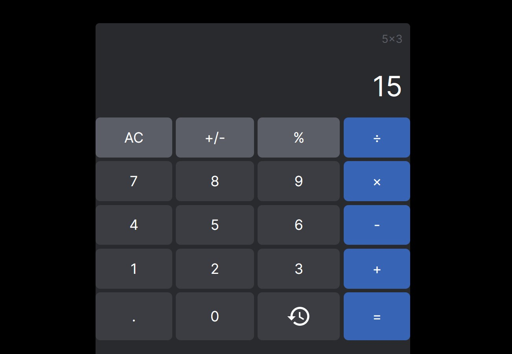

<p align="center">
    
</p>

This is a Next.js app integrated with MongoDB. This is based on the [template](https://github.com/enricosebastian/next-mongo) I did for the same tech stack.

This was originally a challenge that was given to me for a job application, and decided to show it off as part of my full stack knowledge (creating the frontend+making sure an actual live database is in use)

## How to run locally
1. Clone the repository
1. Go to the repo folder in your local computer and run `npm install` to get all the necessary node modules and libraries
1. Create a `.env.local` file that stores the values `MONGODB_URI`, `NODE_ENV`, and `API_URL`
```
// what these environment variables mean
MONGODB_URI --> the MongoDB connection string
NODE_ENV --> usually "developer", but if you're running it in prod, set value as "production"
API_URL --> when running locally, set it as https://localhost:3000/ or whatever port number you're running in right now
```
```
// sample .env.local
MONGODB_URI="mongodb+srv://<username>:<password>@<database-name.weird-code>.mongodb.net/?retryWrites=true&w=majority"
NODE_ENV="developer"
API_URL="http://localhost:3000"
```
4. Run the Next.js command `npm run dev` to have the site run locally
1. If you have set everything correctly, you will be able to access http://localhost:3000 with no issues

## How to host online (via Vercel + GitHub integration)
1. Fork the repository so that you have your own version in GitHub
1. Access Vercel's `Dashboard` by clicking on your profile picture and going to `Dashboard` via the opened dropdown
1. Make sure you're in the `Overview` tab in the `Dashboard`
1. Select `Add New...` and click on `Project`
1. Make sure Vercel's deploy app can see your `calculator-challenge` repo. Import it.
1. Under the `Configure Project` page, look for the `Environmental Variables` section
1. Create the variable names `MONGODB_URI`, `NODE_ENV`, and `API_URL`. Their respective values are the MongoDB connection string, `production`, and the URL vercel plans to use.
```
// sample Environmental Variables
// Note: No quotation marks. Vercel adds it automatically

MONGODB_URI --> mongodb+srv://<username>:<password>@<database-name.weird-code>.mongodb.net/?retryWrites=true&w=majority
NODE_ENV --> developer
API_URL --> http://localhost:3000
```
8. Click deploy and check if you can access the URL.

## Technologies used
<!-- Badges acquired from: https://home.aveek.io/GitHub-Profile-Badges/ -->


